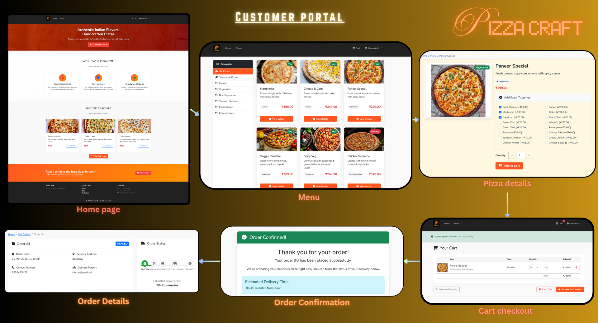
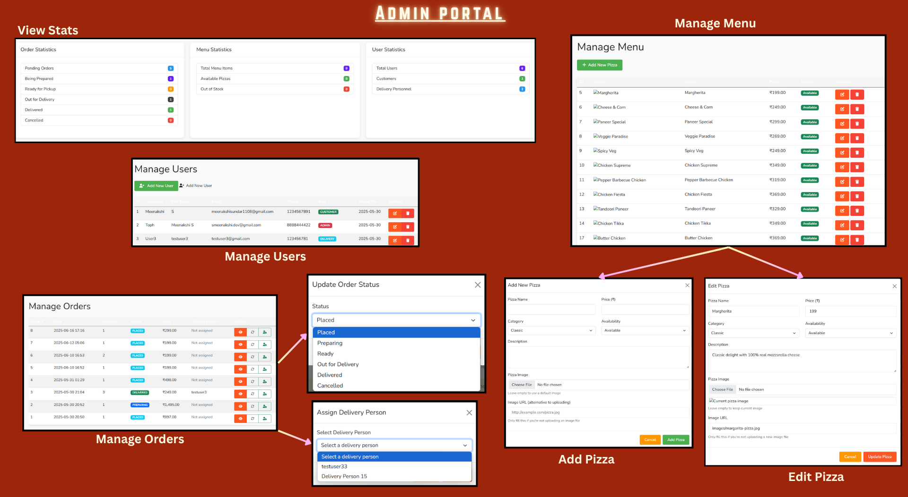

# 🍕PizzaCraft - Pizza Delivery System

[](https://www.java.com)
[](https://www.mysql.com)
[](https://tomcat.apache.org)

A full-featured, responsive web application for pizza ordering and delivery, built with Java EE. PizzaCraft allows customers to browse pizzas, customize toppings, place orders, and track their deliveries.

## Application Screenshots

### Customer Portal


### Admin Portal


### Delivery Portal

## Key Features

- **Comprehensive Menu**: Variety of pizzas with customizable toppings and sizes
- **User Accounts**: Customer registration, login, and profile management
- **Shopping Cart**: Add, update, and remove items easily
- **Order Tracking**: Track order status from preparation to delivery
- **Admin Dashboard**: Manage orders, menu items, and user accounts
- **Responsive Design**: Works seamlessly on desktop and mobile devices
- **Secure Checkout**: Safe and reliable payment processing

## 🛠️ Technology Stack

- **Backend**: Java EE (Servlets, JSP)
- **Frontend**: HTML5, CSS3, JavaScript, Bootstrap 5
- **Database**: MySQL 8.0
- **Build Tool**: Maven
- **Server**: Apache Tomcat 9.0
- **Security**: bcrypt password hashing, input validation, CSRF protection

## Getting Started

### Prerequisites
- JDK 11 or higher
- MySQL 8.0 or higher
- Apache Tomcat 9.0 or higher
- Maven 3.6+ (for dependency management)

### Quick Start

1. **Clone the repository**
   ```powershell
   git clone https://github.com/yourusername/pizzacraft.git
   cd pizzacraft
   ```

2. **Set up the database**
   ```powershell
   mysql -u root -p < database/create_database.sql
   mysql -u root -p pizza_delivery < database/update_schema.sql
   ```

3. **Configure database connection**
   - Navigate to `config/`
   - Update `config.properties` with your MySQL credentials:
     ```properties
     db.url=jdbc:mysql://localhost:3306/pizza_delivery
     db.username=your_username
     db.password=your_password
     db.driver=com.mysql.cj.jdbc.Driver
     ```

4. **Build & Deploy**
   ```powershell
   mvn clean package
   # Copy the WAR file to Tomcat's webapps directory
   cp target/PizzaDeliverySystem.war $TOMCAT_HOME/webapps/
   ```

5. **Access the application**
   - Start Tomcat: `$TOMCAT_HOME/bin/startup.sh` (Linux/Mac) or `$TOMCAT_HOME\bin\startup.bat` (Windows)
   - Open your browser and go to: http://localhost:8080/PizzaDeliverySystem/

## Key Components

- **User Management**: Registration, authentication, role-based access control
- **Order Processing**: Cart management, checkout, order status updates
- **Menu Management**: Dynamic pizza and topping management
- **Admin Dashboard**: Order management, user management, sales analytics

## Architecture

PizzaCraft follows the MVC (Model-View-Controller) architecture:

- **Model**: Java classes representing business entities (User, Pizza, Order)
- **View**: JSP pages rendered in the browser
- **Controller**: Servlets handling HTTP requests and responses

## Code Structure

The codebase is organized into several distinct packages that align with the architectural layers:

### Package Structure

1. **`controller` Package**
   - Servlet classes that handle HTTP requests and route them to appropriate services
   - Subpackages for specific user roles (`admin`, `delivery`)
   - `BaseServlet.java` provides common functionality for all servlets

2. **`service` Package**
   - Business logic implementation
   - Each service class focuses on specific functionality domains:
     - `UserService`: Authentication, user management
     - `OrderService`: Order processing and management
     - `PizzaService`: Menu and product management
     - `CategoryService`: Product categorization
     - `ToppingService`: Pizza customization options

3. **`dao` Package**
   - Database access objects for each entity
   - SQL queries and JDBC operations
   - Transaction management

4. **`model` Package**
   - Java beans representing domain entities:
     - `User`: Customer, admin, and delivery person information
     - `Pizza`: Menu item details
     - `Order`: Order information
     - `OrderItem`: Individual items within an order
     - `ShoppingCart`: Session-based cart functionality
     - `Category`: Pizza categorization
     - `Topping`: Pizza customization options

5. **`database` Package**
   - Connection handling and database configuration
   - Schema verification and repair utilities

## 👥 User Roles

- **Customers**: Browse menu, create orders, track delivery
- **Admins**: Manage menu, handle orders, view analytics
- **Delivery Staff**: Update order status, manage deliveries
